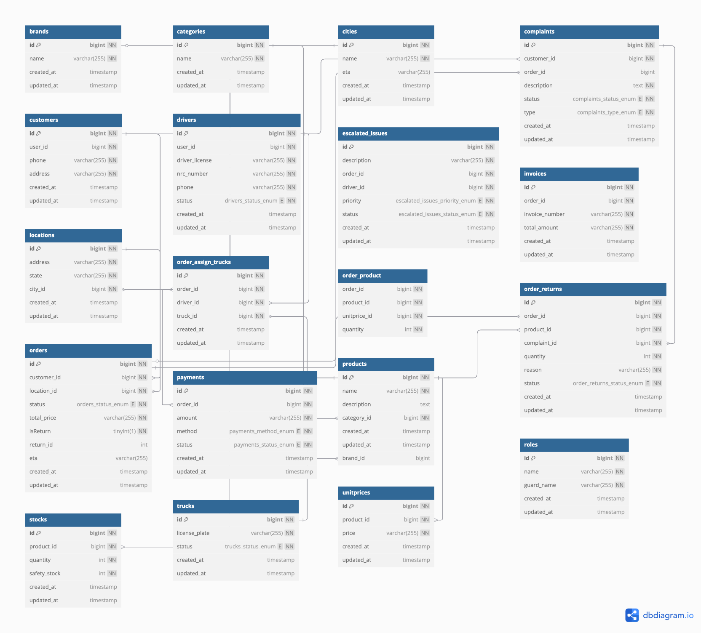

# MyanTech Logistics Management System

A robust backend API service built with Laravel for MyanTech's logistics and delivery management operations.

## 🚀 Key Features

-   **Customer Portal**: Product browsing, shopping cart, and profile management
-   **Order Management**: Processing, tracking, invoicing, and delivery scheduling
-   **Inventory Control**: Stock management, warehouse allocation, and batch tracking
-   **User Management**: Role-based access control for customers, sales managers, drivers, and warehouse managers
-   **Delivery Management**: Route optimization, tracking, and escalation handling
-   **Real-time Updates**: Live order status, chat support, and analytics
-   **Reporting & Analytics**: Customizable reports and performance metrics
-   **Payment Processing**: Multiple payment methods and invoice management
-   **Security**: Role-based permissions, 2FA, and data encryption

## 👥 Role Permissions

### Customer

-   Browse products and manage shopping cart
-   Place and track orders
-   View order history
-   Download invoices
-   Submit complaints and feedback
-   Chat with sales representatives
-   Manage user profile

### Sales Manager

-   View product and order metrics
-   Process and manage orders
-   Track delivery status
-   Handle customer inquiries and complaints
-   Generate sales reports
-   View driver escalations
-   Track returns

### Driver

-   View assigned deliveries
-   Update delivery status
-   Track routes
-   Handle escalations
-   Upload delivery proof
-   Track performance

### Warehouse Manager

-   View stocks and trucks metrics
-   Manage inventory and products
-   Process transfers
-   Handle returns
-   Manage service center operations
-   Oversee location/city management
-   Coordinate truck fleet management
-   Assign orders to trucks or service centers

## 🛠 Tech Stack

### Backend

-   **PHP 8.2**
-   **Laravel 11**
-   **MySQL/PostgreSQL**

### Key Packages

-   Laravel Sanctum (Authentication)
-   Pusher(WebSockets)
-   Spatie Permission (ACL)
-   Spatie Media Library (File Management)

### APIs & Integration

-   RESTful API
-   WebSocket Events
-   SMS/Email Services

### Deployment

-   AWS

### Security

-   Token Authentication
-   Role-based Access

## 📊 Database Schema



## 📋 Prerequisites

-   PHP ^8.2
-   Composer
-   Node.js & NPM
-   MySQL/PostgreSQL

## 🛠 Quick Start

1. Clone and install dependencies:

```bash
git clone <repository-url>
composer install
npm install
```

2. Setup environment:

```bash
cp .env.example .env
php artisan key:generate
php artisan migrate --seed
```

3. Start development server:

```bash
php artisan serve
npm run dev
```

## 📚 Documentation

API documentation: `/api/documentation`

```bash
php artisan l5-swagger:generate
```

## 🔒 Security & Support

-   Security issues: Email [kyaone.hackathon@gmail.com]
-   Support: Create an issue or email [kyaone.hackathon@gmail.com]

## 📄 License

MIT License - see [LICENSE.md](LICENSE.md)
